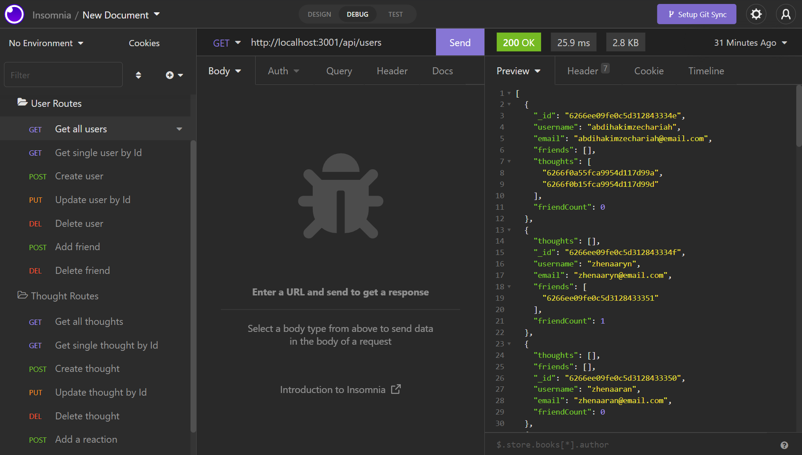

# Social Network Back End Using MongoDB
 

## Description

- A back end for an social network website that uses a MongoDB database.
- Built using the following technologies:
    - Node.js
    - Express.js
    - [Mongoose](https://www.npmjs.com/package/mongoose)

<br>

## Installation

* To use this application, you need to have Node.js and MongoDB installed.

* To run the app:
    1. Clone this repository.
    2. Open up your terminal, navigate to the folder path, and enter the following command to install all dependencies:<br>
    ```npm i```
    3. <i>optional step:</i> To seed with user data, enter `npm run seed` in the terminal.

<br>

## Usage

To start using the application:
1. Enter ```npm start``` to start running the application.
2. Access all API routes via Insomnia.

<br>
<p align="center">
    <i>Walkthrough - Starting the app and testing all USER ROUTES</i>
</p>
<br>

* Create, read, update, and delete users
* Add and remove friends from user's friends list
<br>

<!-- insert video link -->

<br>
<p align="center">
    <i>Walkthrough - testing all THOUGHT ROUTES</i>
</p>
<br>

* Create, read, update, and delete thoughts
* Add and remove reactions from user's thoughts list
<br>

<!-- insert video link -->

<br>

<br>
<p align="center">
    
</p>
<br>

## License
This code is licensed under [MIT License](https://mit-license.org/).

<br>

## Tests
This application has no tests as of the moment.
<br>

<hr>

## Questions
If you have any questions, please don't hesitate to contact:
 * Github - [github.com/nvsco-10](https://github.com/nvsco-10)
 * Email - neemavelasco@gmail.com